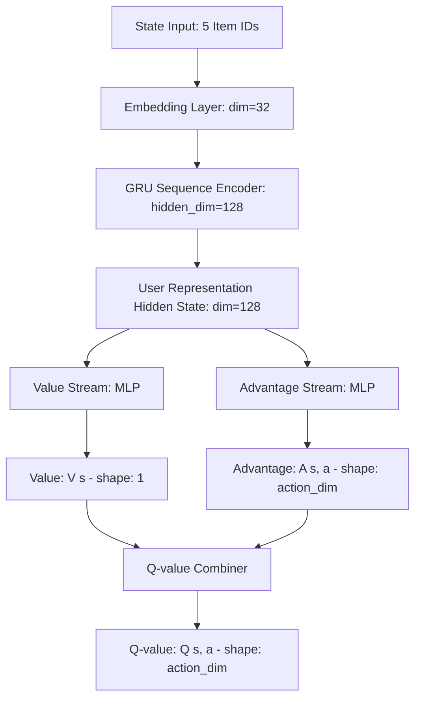

# Giải Thích Kiến Thức Và Mô Hình Hệ Thống Gợi Ý Sản Phẩm Bằng Học Tăng Cường Sâu (DRL)

Tài liệu này giải thích chi tiết toàn bộ kiến thức nền tảng, mô hình toán học (MDP), kiến trúc mạng nơ-ron (GRU Dueling DQN) và các cải tiến kỹ thuật được áp dụng trong dự án **DRL Product Recommendation**.

---

## 1. Giới Thiệu Về Học Tăng Cường Trong Hệ Thống Gợi Ý (Recommender Systems)

Các hệ thống gợi ý truyền thống (như Matrix Factorization hoặc Deep Learning thuần túy) thường tối ưu hóa các mục tiêu ngắn hạn như tỉ lệ click chuột (CTR) tại một thời điểm độc lập. Tuy nhiên, hành vi mua sắm của người dùng là một chuỗi các quyết định có tính tuần tự và phụ thuộc lẫn nhau.

**Học tăng cường sâu (Deep Reinforcement Learning - DRL)** giải quyết vấn đề này bằng cách mô hình hóa quá trình gợi ý dưới dạng một bài toán ra quyết định tuần tự:
* **Mục tiêu lâu dài:** Tối đa hóa tổng phần thưởng (Cumulative Reward) nhận được trong suốt một phiên tương tác (session) của người dùng thay vì chỉ một click đơn lẻ.
* **Tương tác động:** Phản hồi của người dùng đối với các sản phẩm gợi ý sẽ ngay lập tức cập nhật trạng thái sở thích hiện tại của họ để đưa ra các gợi ý tiếp theo chính xác hơn.

---

## 2. Mô Hình Hóa MDP (Markov Decision Process)

Hệ thống được thiết kế dựa trên một MDP gồm các thành phần cơ bản sau:

### Trạng Thái (State - $S$)
* **Định nghĩa:** Trạng thái tại mỗi bước đại diện cho lịch sử hành vi gần nhất của người dùng.
* **Biểu diễn:** Một cửa sổ trượt (sliding window) chứa chuỗi ID của `state_size` sản phẩm mà người dùng đã tương tác gần nhất (mặc định là `state_size = 5`).
* **Ví dụ:** $s_t = [item_1, item_2, item_3, item_4, item_5]$.

### Hành Động (Action - $A$)
* **Định nghĩa:** Đưa ra danh sách gợi ý gồm $K$ sản phẩm cho người dùng.
* **Biểu diễn:** Một tập hợp gồm $K$ hành động (mặc định là `top_k = 5`) tương ứng với $K$ mã ID sản phẩm được chọn từ tập hợp sản phẩm hợp lệ (`valid_actions`).
* **Ví dụ:** $a_t = [rec_1, rec_2, rec_3, rec_4, rec_5]$.

### Phần Thưởng (Reward - $R$)
Phần thưởng được tính dựa trên phản hồi thực tế của người dùng đối với danh sách $K$ sản phẩm được gợi ý:
1. **Hit (Trùng khớp):** Nếu sản phẩm được gợi ý nằm trong tập hợp các sản phẩm tiếp theo mà người dùng thực sự đã tương tác trong lịch sử hành vi thực tế của họ (`target_items`), hệ thống sẽ nhận được phần thưởng dương lớn:
   $$\text{Reward} = \text{số lượng hits} \times \text{hit\_reward} \quad (\text{mặc định } \text{hit\_reward} = +5.0)$$
2. **Miss (Không trùng khớp):** Nếu không có sản phẩm nào gợi ý trúng sở thích tiếp theo của người dùng, hệ thống bị phạt:
   $$\text{Reward} = \text{miss\_penalty} \quad (\text{mặc định } \text{miss\_penalty} = -2.0)$$
3. **Phạt lặp sản phẩm (Duplicate Penalty):** Tránh việc gợi ý lặp lại cùng một sản phẩm trong cùng một lượt hiển thị. Mỗi sản phẩm trùng lặp sẽ bị trừ điểm phạt.

### Chuyển Trạng Thái (Transition - $P$)
* Sau khi thực hiện hành động $a_t$, môi trường dịch chuyển con trỏ lịch sử của người dùng sang phải 1 đơn vị, tạo ra trạng thái tiếp theo $s_{t+1}$ là chuỗi 5 sản phẩm tương tác tiếp theo trong lịch sử thực tế của họ.

---

## 3. Kiến Trúc Mạng Nơ-ron: GRU Dueling DQN

Mô hình học sâu sử dụng sự kết hợp giữa mạng mã hóa chuỗi GRU và kiến trúc mạng Dueling DQN.

### 3.1. Tầng Nhúng (Embedding Layer)
Mỗi sản phẩm (Item ID) được biểu diễn bằng một chỉ số nguyên. Tầng Embedding chuyển đổi các chỉ số này thành các vectơ số thực dày đặc (dense vectors) có kích thước `embedding_dim` (mặc định là `32`). Điều này giúp biểu diễn mối quan hệ ngữ nghĩa giữa các sản phẩm (các sản phẩm hay được mua cùng nhau sẽ có vectơ nhúng gần nhau trong không gian vector).

### 3.2. Bộ Mã Hóa Chuỗi (GRU Encoder)
* Nhận đầu vào là một chuỗi các vectơ nhúng sản phẩm: shape `[batch_size, state_size, embedding_dim]`.
* Mạng **GRU (Gated Recurrent Unit)** duyệt qua chuỗi để nắm bắt thông tin tuần tự và xu hướng sở thích thay đổi của người dùng theo thời gian.
* Đầu ra ẩn cuối cùng của GRU (hidden state $h_n$ tương ứng với phần tử cuối) được lấy ra để làm vectơ đặc trưng biểu diễn sở thích hiện tại của người dùng (User Representation, kích thước `hidden_dim = 128`).

### 3.3. Nhánh Phân Tách Dueling (Dueling Streams)
Kiến trúc Dueling chia mạng nơ-ron thành hai nhánh song song sau lớp đặc trưng ẩn:
1. **Value Stream ($V(s)$):** Ước tính giá trị trung bình của trạng thái hiện tại $s$ (mức độ tốt chung của lịch sử tương tác hiện tại của người dùng). Đầu ra là 1 giá trị vô hướng (scalar).
2. **Advantage Stream ($A(s, a)$):** Ước tính lợi thế vượt trội của từng hành động cụ thể $a$ (gợi ý sản phẩm $a$) so với các sản phẩm khác khi ở trạng thái $s$. Đầu ra là một vectơ có kích thước bằng số lượng sản phẩm (`action_dim`).

### 3.4. Công Thức Kết Hợp (Combining Operator)
Giá trị Q-value được tính toán bằng cách kết hợp giá trị trạng thái và lợi thế hành động thông qua công thức trừ đi trung bình của Advantage nhằm đảm bảo tính định danh duy nhất (identifiability) và tăng tính ổn định khi huấn luyện:
$$Q(s, a) = V(s) + \left(A(s, a) - \frac{1}{|A|} \sum_{a'} A(s, a')\right)$$

---

## 4. Các Cải Tiến Và Thuật Toán Huấn Luyện

### 4.1. Double DQN & Target Network
* Sử dụng hai mạng nơ-ron có cấu trúc giống nhau: **Q-Network chính** (dùng để chọn hành động và tối ưu hóa tham số) và **Target Q-Network** (dùng để tính toán giá trị Q mục tiêu cố định tạm thời).
* Giúp loại bỏ hiện tượng tự phóng đại giá trị Q (Overestimation bias) trong thuật toán Q-learning truyền thống. Cứ mỗi `target_update_freq` bước, trọng số từ Q-Network chính sẽ được sao chép sang Target Q-Network.

### 4.2. Khử Trùng Lặp Và Chặn Hành Động (Action Masking)
* **Banned Actions:** Khi gợi ý $K$ sản phẩm trong một lượt, hệ thống sẽ loại bỏ các sản phẩm đã được gợi ý trước đó trong cùng một phiên tương tác để tăng tính đa dạng (Diversity).
* **Valid Actions:** Trong tập dữ liệu thực tế, chỉ một số sản phẩm nhất định là có dữ liệu tương tác. Hệ thống sử dụng một lớp mặt nạ (Mask) để đảm bảo tác nhân chỉ chọn các sản phẩm nằm trong danh mục hợp lệ (`valid_actions_tensor`).

### 4.3. Recency Prior Boost (Thúc đẩy sản phẩm tương tác gần đây)
Đây là một cơ chế heuristic tích hợp vào quá trình ra quyết định nhằm khai thác tính chất "người dùng có xu hướng tiếp tục quan tâm đến các sản phẩm họ vừa xem gần đây":
* Nếu sản phẩm $a$ đã xuất hiện trong trạng thái hiện tại $s$ (tức là 5 sản phẩm gần nhất người dùng vừa tương tác), điểm Q-value của nó sẽ được cộng thêm một lượng hằng số $\lambda$ (`recent_boost`):
  $$Q_{boosted}(s, a) = Q(s, a) + \lambda \quad (\text{với } a \in s)$$
* **Ưu điểm:** Giúp mô hình bắt kịp ngay lập tức xu hướng ngắn hạn của người dùng, đặc biệt hiệu quả khi dữ liệu tương tác có độ phụ thuộc cao vào tính gần đây (recency). Dự án thử nghiệm 3 mức độ thúc đẩy: $\lambda = 0.0$ (không boost), $\lambda = 2.0$, và $\lambda = 5.0$.

### 4.4. Smooth L1 Loss (Huber Loss)
Hệ thống sử dụng Smooth L1 Loss để tính toán lỗi giữa giá trị $Q(s, a)$ dự đoán và giá trị mục tiêu $Q_{target}$:
$$\text{Loss} = \text{SmoothL1}(Q(s, a) - [r + \gamma \max_{a'} Q_{target}(s', a')])$$
Smooth L1 hoạt động như L1 Loss khi sai số lớn (tránh bùng nổ gradient) và hoạt động như L2 Loss khi sai số nhỏ (hội tụ mượt mà).

---

## 5. Quy Trình Đánh Giá (Validation/Test Suite)

Mô hình sau khi huấn luyện được đánh giá thông qua các chỉ số quan trọng trong Hệ thống gợi ý:
1. **HitRate@5:** Tỉ lệ có ít nhất 1 sản phẩm gợi ý trúng sở thích của người dùng trong số 5 sản phẩm gợi ý.
2. **Precision@5:** Tỉ lệ sản phẩm gợi ý chính xác trong danh sách 5 sản phẩm được đưa ra.
3. **Recall@5:** Tỉ lệ bao phủ các sản phẩm người dùng thực sự thích được gợi ý thành công.
4. **NDCG@5 (Normalized Discounted Cumulative Gain):** Chỉ số đo lường chất lượng xếp hạng gợi ý, ưu tiên các sản phẩm trúng đích nằm ở vị trí cao hơn trong danh sách gợi ý.

Quá trình chạy validation và test sẽ so sánh các phiên bản mô hình khác nhau để tự động chọn ra checkpoint tốt nhất dựa trên điểm **Validation HitRate@5**.
