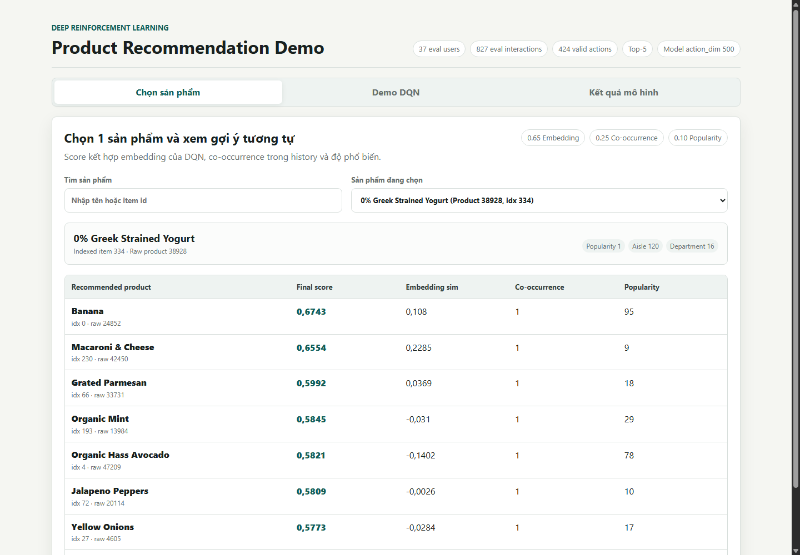
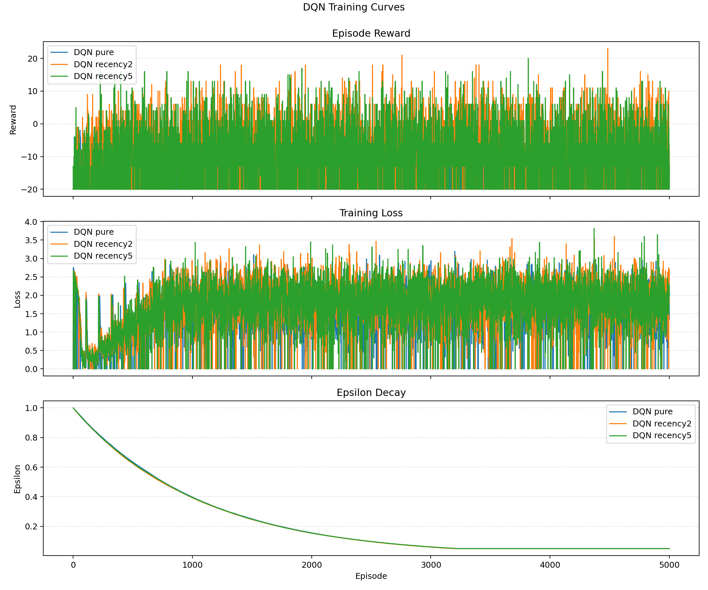
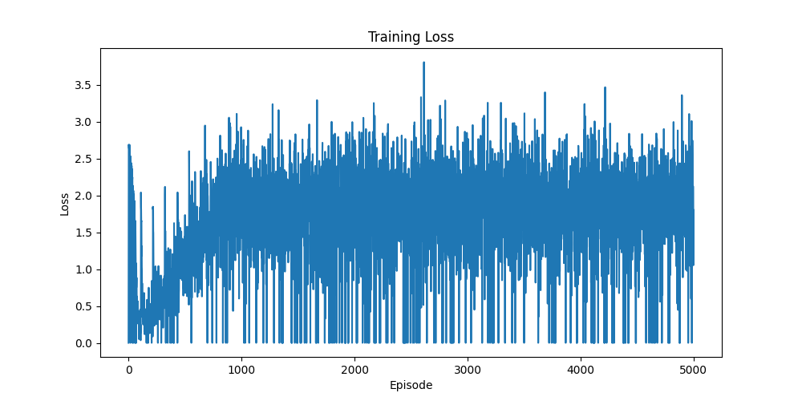
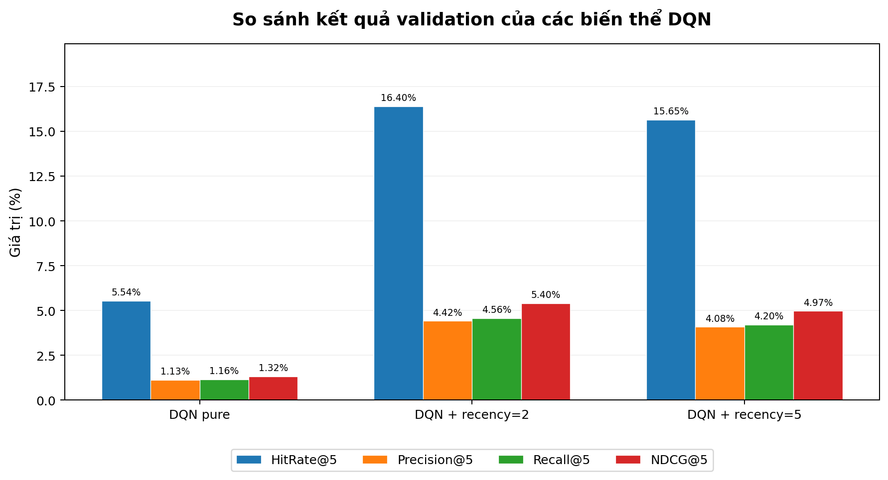
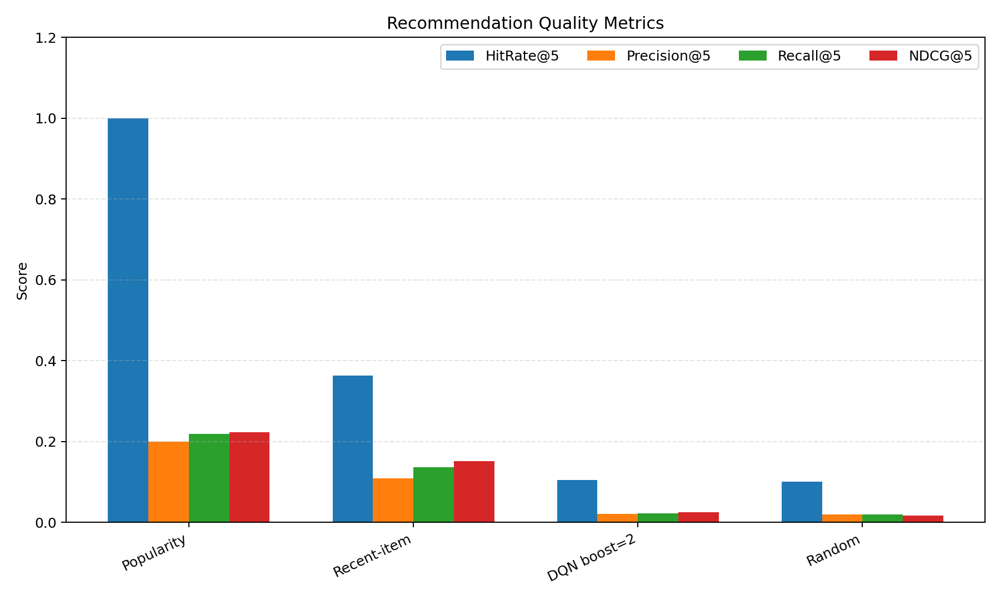

# Hệ thống gợi ý sản phẩm bằng Deep Reinforcement Learning

Dự án xây dựng một hệ thống gợi ý sản phẩm cá nhân hóa cho bài toán e-commerce, sử dụng Deep Q-Network (DQN) để dự đoán các sản phẩm tiếp theo dựa trên lịch sử mua hàng gần nhất của người dùng.

Mô hình được huấn luyện trên dữ liệu lịch sử mua hàng đã index, đánh giá theo temporal split train/validation/test, so sánh với các baseline phổ biến, và có demo web local để trực quan hóa kết quả gợi ý.

## Mục tiêu

- Biểu diễn trạng thái người dùng bằng `state_size = 5` sản phẩm gần nhất.
- Dự đoán Top-K sản phẩm tiếp theo với `top_k = 5`.
- Huấn luyện DQN trên không gian hành động gồm 1000 sản phẩm phổ biến nhất.
- So sánh DQN thuần với DQN có recency prior và các baseline.
- Xây dựng demo web hiển thị tên sản phẩm thật, điểm gợi ý, hit/miss và các biểu đồ đánh giá.

## Demo

Demo web đọc dữ liệu từ `data/demo/demo_data.json` và chạy trực tiếp bằng static server.



Chạy demo:

```powershell
python demo/build_demo_data.py `
  --model_path outputs/checkpoints/dqn_recency5_stable_best.pth `
  --metrics_csv outputs/logs/visualization_smoke/final_test_results.csv `
  --case_history_path data/processed/indexed_history.pkl `
  --max_case_users 1000 `
  --max_windows_per_user 20 `
  --max_cases 300

python -m http.server 8000 --bind 127.0.0.1
```

Mở trình duyệt:

```text
http://127.0.0.1:8000/demo/index.html
```

Demo gồm 3 phần chính:

- Chọn sản phẩm: chọn một sản phẩm và xem các sản phẩm tương tự theo embedding similarity, co-occurrence, popularity và điểm tổng hợp.
- Demo DQN: chọn một case người dùng, xem 5 sản phẩm gần nhất, Top-5 gợi ý của DQN, target thật, hit/miss, reward và HitRate@5.
- Kết quả mô hình: xem bảng so sánh DQN với Random, Popularity và Recent-item baseline.

Lưu ý: để demo hiện tên sản phẩm thật thay vì `Indexed item X`, cần kéo đủ dữ liệu Git LFS, đặc biệt là `orders.csv` và `order_products__prior.csv`.

```powershell
git lfs pull
```

## Pipeline tổng quan

```text
Raw Instacart CSV
        |
        v
Tiền xử lý top 1000 sản phẩm
        |
        v
indexed_history.pkl
        |
        v
Train / Validation / Test split theo thời gian
        |
        v
Huấn luyện DQN
        |
        v
Chọn model theo validation HitRate@5
        |
        v
Đánh giá cuối trên test set và build demo
```

## Cấu trúc thư mục

```text
data/                 Dữ liệu raw, dữ liệu đã xử lý và demo JSON
demo/                 Giao diện demo web local
eda/                  Script tiền xử lý dữ liệu
env/                  Recommendation environment cho DQN
models/               DQN model và DQN agent
training/             Script huấn luyện
evaluation/           Script đánh giá DQN và baseline
utils/                Tiện ích inspect/split history
outputs/              Checkpoint, log, report và ảnh kết quả
visualization/        Script trực quan hóa kết quả
```

## Cài đặt

```powershell
python -m venv venv
.\venv\Scripts\Activate.ps1
pip install -r requirements.txt
git lfs pull
```

Các thư viện chính:

- `torch`
- `pandas`
- `numpy`
- `matplotlib`

## Dữ liệu

Dự án sử dụng dữ liệu đơn hàng dạng Instacart:

- `data/orders.csv`
- `data/products.csv`
- `data/order_products__prior.csv`
- `data/order_products__train.csv`

Sau tiền xử lý, mỗi user được biểu diễn thành chuỗi item index. Item index là id nội bộ của 1000 sản phẩm phổ biến nhất. Demo sẽ map ngược item index sang `product_id` và `product_name` thật từ raw CSV.

Thống kê dữ liệu đã xử lý:

| Split | Users | Interactions | Unique items | Avg actions/user |
|---|---:|---:|---:|---:|
| Full indexed history | 197,227 | 18,215,667 | 1,000 | 92.36 |
| Train | 71,752 | 10,076,939 | 1,000 | 140.44 |
| Validation | 71,752 | 2,166,570 | 1,000 | 30.20 |
| Test | 71,752 | 2,200,411 | 1,000 | 30.67 |

## Cách chạy lại từ đầu

Tiền xử lý dữ liệu:

```powershell
python eda/preprocessed.py
```

Tạo train/validation/test split:

```powershell
python -m utils.split_history_train_val_test `
  --input_path data/processed/indexed_history.pkl `
  --train_output_path data/processed/train_history.pkl `
  --val_output_path data/processed/val_history.pkl `
  --test_output_path data/processed/test_history.pkl `
  --train_ratio 0.7 `
  --val_ratio 0.1 `
  --test_ratio 0.2 `
  --min_history_len 11
```

Huấn luyện DQN thuần:

```powershell
python -m training.train_dqn `
  --data_path data/processed/train_history.pkl `
  --episodes 10000 `
  --action_dim 1000 `
  --model_path outputs/checkpoints/dqn_pure_stable.pth `
  --log_path outputs/logs/train_dqn_pure_stable.csv `
  --recent_boost 0
```

Huấn luyện DQN với recency prior `boost=2`:

```powershell
python -m training.train_dqn `
  --data_path data/processed/train_history.pkl `
  --episodes 10000 `
  --action_dim 1000 `
  --model_path outputs/checkpoints/dqn_recency2_stable.pth `
  --log_path outputs/logs/train_dqn_recency2_stable.csv `
  --recent_boost 2
```

Huấn luyện DQN với recency prior `boost=5`:

```powershell
python -m training.train_dqn `
  --data_path data/processed/train_history.pkl `
  --episodes 10000 `
  --action_dim 1000 `
  --model_path outputs/checkpoints/dqn_recency5_stable.pth `
  --log_path outputs/logs/train_dqn_recency5_stable.csv `
  --recent_boost 5
```

Chọn model bằng validation và đánh giá trên test:

```powershell
python -m evaluation.run_val_test_suite `
  --val_data_path data/processed/val_history.pkl `
  --test_data_path data/processed/test_history.pkl `
  --episodes 1000 `
  --top_k 5 `
  --action_dim 1000 `
  --checkpoint_dir outputs/checkpoints `
  --pure_model dqn_pure_stable_best.pth `
  --boost2_model dqn_recency2_stable_best.pth `
  --boost5_model dqn_recency5_stable_best.pth `
  --output_dir outputs/logs/visualization_smoke
```

## Kết quả huấn luyện

Biểu đồ huấn luyện của DQN:



Một số biểu đồ log huấn luyện bổ sung:





## Kết quả validation

Model được chọn theo `validation HitRate@5`.

| Method | Avg Reward | HitRate@5 | Precision@5 | Recall@5 | NDCG@5 | Recent Boost |
|---|---:|---:|---:|---:|---:|---:|
| DQN + recency prior boost=5 | -3.992 | 0.1462 | 0.0394 | 0.0404 | 0.0477 | 5.0 |
| DQN + recency prior boost=2 | -4.325 | 0.1416 | 0.0384 | 0.0394 | 0.0465 | 2.0 |
| DQN pure stable | -8.585 | 0.0624 | 0.0127 | 0.0131 | 0.0129 | 0.0 |

Model được chọn:

```text
DQN + recency prior boost=5
Checkpoint: outputs/checkpoints/dqn_recency5_stable_best.pth
```

## Kết quả test cuối



| Method | Avg Reward | HitRate@5 | Precision@5 | Recall@5 | NDCG@5 | Type |
|---|---:|---:|---:|---:|---:|---|
| Recent-item baseline | -1.221 | 0.2059 | 0.0522 | 0.0538 | 0.0564 | baseline |
| Popularity baseline | -4.365 | 0.1668 | 0.0364 | 0.0373 | 0.0387 | baseline |
| DQN + recency prior boost=5 | -4.511 | 0.1456 | 0.0373 | 0.0384 | 0.0459 | dqn |
| Random baseline | -10.649 | 0.0252 | 0.0051 | 0.0052 | 0.0054 | baseline |

Kết luận thực nghiệm:

- DQN + recency prior boost=5 là DQN tốt nhất trên validation.
- Trên test set, Recent-item baseline vẫn có HitRate@5 cao nhất.
- DQN thuần chưa vượt qua heuristic mạnh dựa trên hành vi gần nhất.
- Khi báo cáo kết quả, model tốt nhất của nhóm DQN nên gọi là `DQN + recency prior`, không gọi là DQN thuần.

## Reward và metric

Reward trong environment:

```text
Hit reward: +5.0
Miss penalty: -2.0
```

Các metric đánh giá:

- `Average Reward`
- `HitRate@5`
- `Precision@5`
- `Recall@5`
- `NDCG@5`

## File kết quả quan trọng

- Report validation/test: `outputs/logs/visualization_smoke/train_val_test_report.md`
- Kết quả test CSV: `outputs/logs/visualization_smoke/final_test_results.csv`
- Kết quả chọn model: `outputs/logs/best_selected_by_validation.json`
- Checkpoint được chọn: `outputs/checkpoints/dqn_recency5_stable_best.pth`
- Demo data: `data/demo/demo_data.json`
- Demo screenshot: `outputs/demo_screenshot.png`

## Ghi chú khi trình bày

- Item id trong model là index nội bộ, không phải `product_id` gốc.
- Demo đã map index nội bộ sang tên sản phẩm thật bằng `products.csv`.
- Kết quả test chỉ dùng để báo cáo cuối, không dùng để chọn model.
- Recent-item baseline là baseline mạnh trong bài toán mua lại sản phẩm, vì hành vi mua hàng thường có tính lặp lại cao.
